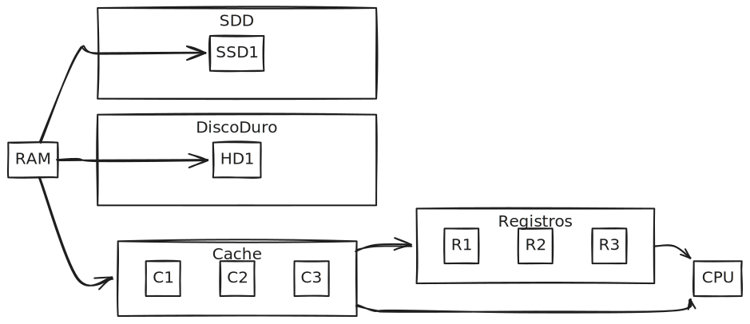

## Memoria: La Base del Almacenamiento y Recuperación de Datos

La memoria, en el contexto de la arquitectura de computadores, no se limita a ser un simple almacén de información. Representa un sistema complejo y jerarquizado que influye de manera significativa en el rendimiento general del sistema informático. Una gestión eficiente de la memoria es crucial para la ejecución fluida de las aplicaciones y para la optimización del rendimiento del sistema.

### Jerarquía de Memoria: Un Enfoque en la Eficiencia

La jerarquía de memoria es un modelo de organización fundamental en la arquitectura de computadores, que busca equilibrar la necesidad de acceso rápido a los datos con las limitaciones de costo y capacidad. Se basa en la premisa de que diferentes niveles de memoria ofrecen diferentes características en cuanto a velocidad, costo y capacidad.

*   **Niveles Típicos:**
    *   **Registros (CPU):** Los registros constituyen el nivel más alto de la jerarquía, ubicados directamente dentro de la CPU. Son extremadamente rápidos y de costo elevado, lo que limita su capacidad. Se utilizan para almacenar los datos e instrucciones que la CPU necesita de forma inmediata.
    *   **Caché (L1, L2, L3):** La memoria caché se sitúa entre los registros y la RAM. Es más rápida y más cara que la RAM, pero más lenta y menos costosa que los registros. La caché se divide en diferentes niveles (L1, L2, L3), cada uno con un tamaño y una velocidad específicos, para optimizar el acceso a los datos utilizados con mayor frecuencia.
    *   **Memoria Principal (RAM):** La memoria principal, o RAM (Random Access Memory), ofrece una capacidad mayor que la caché, pero es más lenta y barata. Se utiliza para almacenar los programas en ejecución y los datos que necesitan ser accedidos de forma relativamente rápida.
    *   **Almacenamiento Secundario (Disco Duro, SSD):** El almacenamiento secundario, como los discos duros (HDD) y las unidades de estado sólido (SSD), proporciona la mayor capacidad de almacenamiento, pero es significativamente más lento que la RAM. Se utiliza para almacenar los datos y programas que no se necesitan de forma inmediata.

*   **Principio de Localidad:** El principio de localidad es un concepto fundamental que explica el funcionamiento de la jerarquía de memoria. Este principio establece que los programas tienden a acceder a datos e instrucciones que están ubicados cerca en el tiempo y en el espacio. La memoria caché aprovecha este principio para almacenar los datos e instrucciones que se utilizan con mayor frecuencia, permitiendo un acceso más rápido a los mismos y mejorando el rendimiento general del sistema.

    *   **Diagrama de la Jerarquía (Simplificado):**

        

### Tipos de Memoria RAM: SRAM, DRAM y SDRAM

La memoria RAM, como componente esencial de la memoria principal, se presenta en diferentes tipos, cada uno con características específicas que los hacen adecuados para distintos propósitos.

*   **SRAM (Static RAM):**
    *   **Características:** La SRAM se distingue por su velocidad superior, gracias a la utilización de flip-flops (transistores) para el almacenamiento de datos. Esta tecnología elimina la necesidad de refresco, pero incrementa el costo y reduce la densidad en comparación con la DRAM.
    *   **Usos:** La SRAM se emplea comúnmente en la caché de la CPU, donde la velocidad es un factor crítico.
*   **DRAM (Dynamic RAM):**
    *   **Características:** La DRAM, en contraste, es más lenta que la SRAM. Utiliza capacitores para almacenar datos, lo que requiere un refresco constante para evitar la pérdida de información. A pesar de su menor velocidad, la DRAM es más económica y ofrece una mayor densidad, lo que la hace ideal para la memoria principal.
    *   **Usos:** La DRAM se utiliza principalmente como memoria principal en los sistemas informáticos.
*   **SDRAM (Synchronous Dynamic RAM):**
    *   **Características:** La SDRAM representa una mejora con respecto a la DRAM tradicional. Se sincroniza con el reloj del sistema, lo que permite una mayor velocidad y eficiencia en la transferencia de datos.
    *   **Variantes:** Dentro de SDRAM, existen las DDR (Double Data Rate) SDRAM, que transfieren datos dos veces por ciclo de reloj, duplicando el ancho de banda en comparación con la SDRAM original. Las DDR se suceden con DDR2, DDR3, DDR4 y DDR5, cada una incrementando la velocidad y eficiencia.

### Memoria Caché: Acelerando el Acceso a la Memoria

La memoria caché es un componente crucial que se encarga de reducir el tiempo de acceso a la memoria. Lo hace almacenando temporalmente los datos y las instrucciones que se utilizan con frecuencia. Su presencia en la jerarquía de memoria permite que la CPU acceda a la información esencial de forma mucho más rápida, mejorando el rendimiento general del sistema.

*   **Estructura:**
    *   **L1 Cache:** La caché de primer nivel, integrada directamente en el núcleo de la CPU, es la más rápida y la más pequeña. Se utiliza para almacenar las instrucciones y los datos que la CPU necesita de forma más inmediata.
    *   **L2 Cache:** La caché de segundo nivel, de mayor tamaño que la L1, se ubica cerca del núcleo de la CPU. Ofrece un equilibrio entre velocidad y capacidad, almacenando datos que no se acceden con tanta frecuencia como los de la L1.
    *   **L3 Cache:** La caché de tercer nivel, presente en algunos procesadores, es la más grande y la más lenta de las tres. Se comparte entre todos los núcleos de la CPU, lo que permite una mayor eficiencia en el acceso a datos compartidos.
*   **Mecanismos:**
    *   **Hit:** Se produce cuando los datos solicitados se encuentran en la caché, permitiendo un acceso rápido y directo a la información.
    *   **Miss:** Ocurre cuando los datos no están presentes en la caché, lo que requiere que la CPU acceda a la memoria principal, incurriendo en una latencia mayor.
    *   **Políticas de Reemplazo:** Debido a la limitada capacidad de la caché, es necesario implementar políticas de reemplazo para decidir qué datos se eliminan cuando se necesita espacio para nueva información. La política LRU (Least Recently Used - "Menos Usado Recientemente") es una de las más comunes, donde se eliminan los datos que no se han utilizado durante un período más largo.

    *   **Tipos de Mapeo de la Caché:**
        *   **Directo:** Cada bloque de memoria principal se mapea a una línea específica en la caché. Es simple de implementar, pero puede generar conflictos si varios bloques de memoria compiten por la misma línea.
        *   **Asociativo:** Permite que un bloque de memoria principal se ubique en cualquier línea de la caché, ofreciendo mayor flexibilidad pero incrementando la complejidad y el costo.
        *   **Conjunto-Asociativo:** Representa un compromiso entre el mapeo directo y el asociativo. La caché se divide en conjuntos (sets), y un bloque de memoria principal se mapea a un conjunto específico, pero puede ubicarse en cualquier línea dentro de ese conjunto.

### Memoria Virtual: Ampliando el Espacio de Memoria

La memoria virtual es una técnica que permite a los programas utilizar un espacio de direcciones mayor que la memoria física disponible en el sistema. Esta capacidad resulta esencial para ejecutar aplicaciones complejas que requieren grandes cantidades de memoria.

*   **Funcionamiento:**
    *   La memoria virtual divide el espacio de direcciones en bloques de tamaño fijo, conocidos como páginas.
    *   La memoria física se divide de forma similar en marcos de página.
    *   El sistema operativo se encarga de gestionar la correspondencia entre las páginas virtuales y los marcos de página físicos, utilizando una estructura de datos conocida como tabla de páginas.
    *   **Page Tables (Tablas de Páginas):** Las tablas de páginas mapean las direcciones virtuales a las direcciones físicas, indicando si una página reside en la memoria principal o en el almacenamiento secundario (disco duro).
    *   **Page Fault (Fallo de Página):** Cuando un programa intenta acceder a una página que no se encuentra en la memoria principal (es decir, está en el disco duro), se produce un fallo de página. El sistema operativo responde interrumpiendo la ejecución del programa, cargando la página desde el disco a la memoria, y actualizando la tabla de páginas.